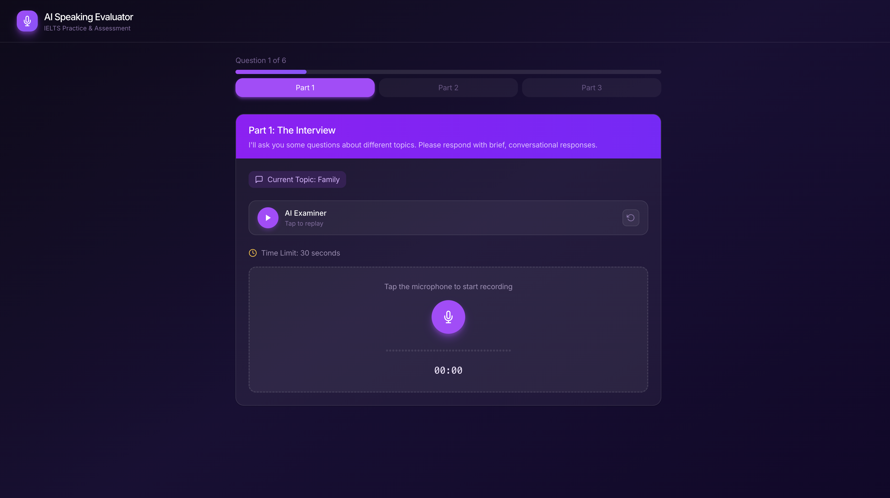
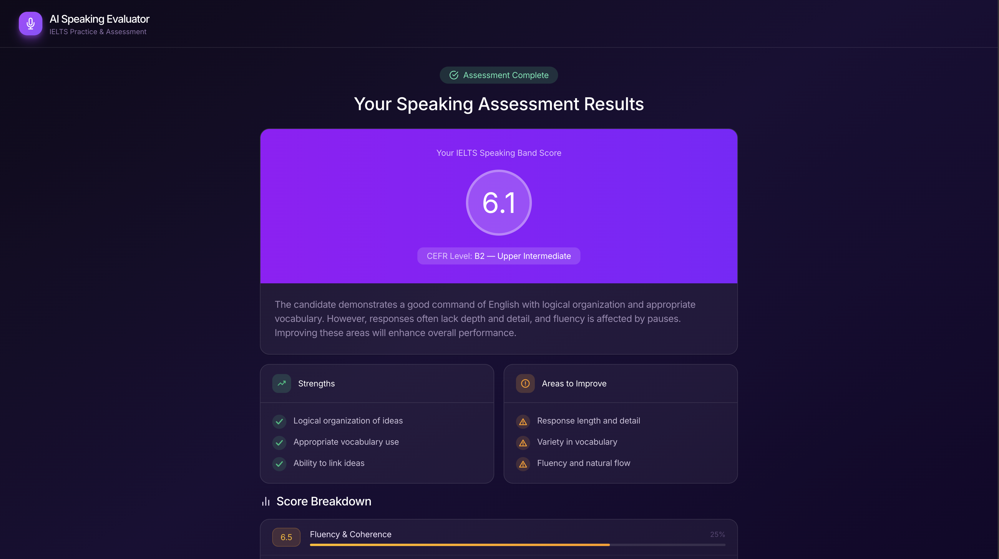

# AI Speaking Evaluator

**Live at: [ai-speaking-evaluator.onrender.com](https://ai-speaking-evaluator.onrender.com)**

An AI-powered English speaking test that simulates an IELTS-style structured interview. The system generates adaptive questions, analyzes responses through a speech + LLM pipeline, and produces band scores (1–9) with detailed CEFR-mapped feedback.

---

## Screenshots

**Home — choose voice or text mode**


**Live Test — Part 1 with AI examiner and voice recording**


**Results — IELTS band score, CEFR level, and score breakdown**


---

## Features

- **Voice & Text modes** — record spoken responses or type them
- **3-part adaptive interview** — mirrors the IELTS speaking exam structure
- **AI examiner** — generates contextual follow-up questions based on your answers
- **Relevance detection** — redirects off-topic responses before skipping
- **Real-time TTS** — questions are read aloud in voice mode
- **Hybrid scoring** — objective speech metrics (WPM, pauses) combined with LLM evaluation
- **IELTS band scores (1–9)** with CEFR mapping (A1–C2) and per-criterion breakdown

---

## Test Structure

| Part | Format | Focus |
|------|--------|-------|
| **Part 1 — Interview** | 3 topics × 2 questions | Familiar topics, concise responses |
| **Part 2 — Long Turn** | Prompt card + 1 min prep | Extended structured response |
| **Part 3 — Discussion** | 3 main questions + follow-ups | Abstract reasoning, thematic depth |

---

## Scoring Criteria

| Criterion | Weight |
|-----------|--------|
| Fluency & Coherence | 25% |
| Lexical Resource | 20% |
| Grammar Range & Accuracy | 20% |
| Coherence & Cohesion | 15% |
| Task Achievement | 20% |

---

## Tech Stack

| Layer | Technology |
|-------|-----------|
| **Backend** | Python, FastAPI |
| **Frontend** | Vanilla JS, HTML, CSS |
| **LLM — Examiner** | OpenAI GPT-4o-mini |
| **LLM — Scoring** | OpenAI GPT-4o |
| **Speech-to-Text** | OpenAI Whisper |
| **Text-to-Speech** | OpenAI TTS |
| **Config** | python-dotenv |

---

## Project Structure

```
backend/
  main.py               → FastAPI app, CORS, static file serving
  config.py             → Models, constants, scoring weights
  state_management.py   → Part initialization + session state helpers
  llm_functions.py      → GPT prompts, question generation, scoring
  voice_functions.py    → Whisper STT, TTS, timing metrics
  scoring.py            → IELTS rubric, band scores, CEFR mapping
  utils.py              → Formatting, timers, silence detection
  routes/
    session.py          → Session management endpoints
    test_flow.py        → Test progression endpoints
    audio.py            → Audio / TTS endpoints
  services/
    session_store.py    → In-memory session storage
    test_engine.py      → Core test logic state machine

frontend/
  index.html            → Main HTML page
  css/style.css         → Dark-mode UI styles
  js/
    app.js              → App logic + state machine
    api.js              → Backend API client
    audio.js            → Audio recording / playback
    timer.js            → Countdown timers
    ui.js               → DOM rendering helpers
```

---

## Running Locally

```bash
git clone https://github.com/YOUR_USERNAME/ai-speaking-evaluator.git
cd ai-speaking-evaluator

python3 -m venv .venv
source .venv/bin/activate  # Windows: .venv\Scripts\activate

pip install -r requirements.txt
```

Create a `.env` file:

```
OPENAI_API_KEY=your_key_here
```

Start the server:

```bash
uvicorn backend.main:app --reload
```

Open [http://localhost:8000](http://localhost:8000) in your browser.

---

## Why I Built This

Many people in my family are Spanish speakers and wanted a way to practice spoken English without pressure. This project provides a realistic, adaptive speaking test with rubric-based feedback powered by speech and LLM evaluation.
